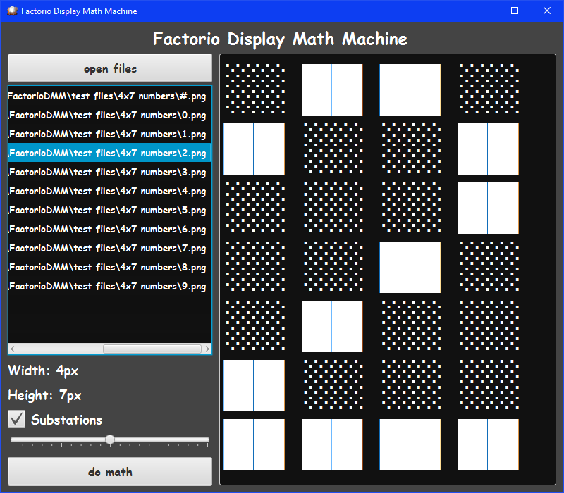
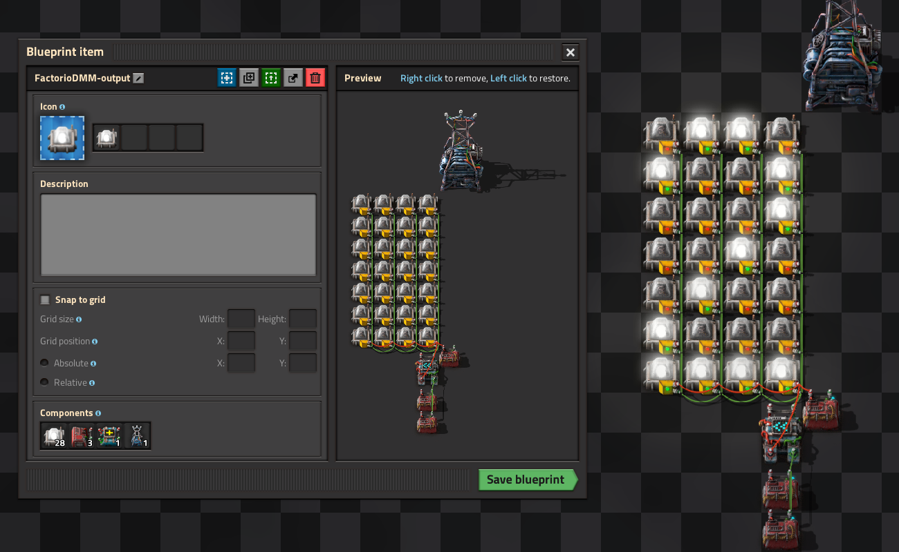

# Factorio Display Math Machine

### About
* This is a JavaFX Application
* It converts a series of images into on/offsignal values
* It outputs a Factorio Blueprint String

### ✔ Todo List
* [ ] GUI redesign
* [ ] Add ViewManager
* [ ] Add other generation method (requires ViewManager)
* [x] ~~Make Signal List~~
* [x] ~~Sucessfully output encoded Blueprint String~~

### 💡 Ideas
* [ ] Add more frames
* [ ] Implement colours (new technique)
* [ ] Read video formats
* [x] ~~Add more signals (segmenting)~~
* [x] ~~Read GIF format~~

### Useful links:
* https://wiki.factorio.com/Blueprint_string_format
* https://wiki.factorio.com/Data.raw
* https://factorio.tmin10.ru/
